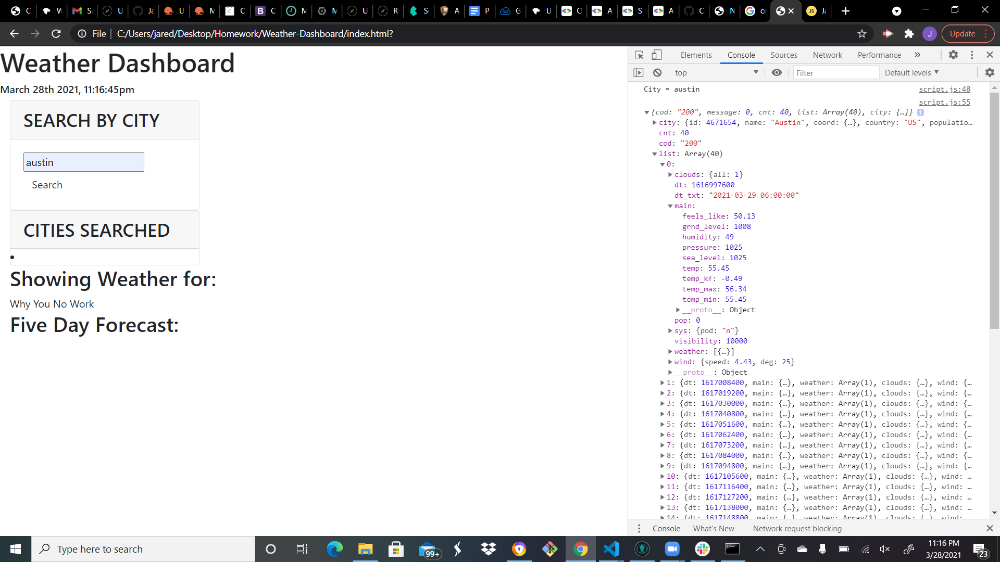

# Weather-Dashboard
The purpose of this Homework was to be able to access and use an API and use the data on our webpage. In this case, we needed to get the information for a Cities Weather Conditions that a user wants to search for. It needed current and future conditions for that city and that city is added to the search history and am presented with the city name, the date, an icon representation of weather conditions, the temperature, the humidity, the wind speed, and the UV index. The uv index also needed to change color based on the condition. It also needed a 5 day forecast that displays the date, an icon representation of weather conditions, the temperature, and the humidity.

## What I did
I started by making an account to openWeather and getting myself an API key. Then once I got a base html, I started a JS function that called the api data for me to use to append to the page.However, I got very lost in trying to append the information. I was able to access the api information at least.

## Screenshot

## webpage link 

